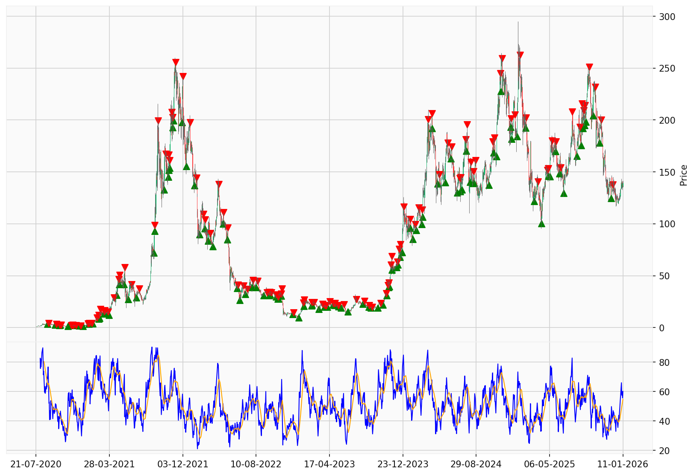

# Bitcapital-SOL-Portfolio

> Automated technical-analysis bot for SOL/USD. Runs daily on GitHub Actions,
> computes RSI/SMA signals on CryptoCompare data, and emails an HTML report
> with embedded charts and an Excel attachment.

*5+ years of SOL price (Jul 2020 – Jan 2026) with strategy signals:
green ▲ = BUY, red ▼ = SELL. RSI(14) + SMA(14) overlay below.*

---

## Context

Built as an internal tool for [Bitcapital](https://bitcapital.fr), a
crypto advisory firm I co-founded (now winding down). The bot replaced
the manual chart-watching workflow I was doing every morning for 100+
advisory clients: it now runs unattended every day at 00:00 UTC,
computes the signals, and emails the report.

This repo is the **SOL/USD daily version** running the **BCM Strategy V1**
(Bitcoin Cash Momentum, RSI/SMA crossover with price filter). A parallel
BTC weekly version uses the same architecture.

---

## What it does

1. **Fetches** the last ~2000 daily candles from the CryptoCompare API
2. **Computes** RSI(14) and its SMA(14), plus a SMA(9) on the close price
3. **Detects signals** using BCM Strategy V1 — see logic below
4. **Backtests** the signal series to produce trade-level performance stats
5. **Plots** the price chart with buy/sell markers and the RSI/SMA panel
6. **Exports** an Excel workbook with the full enriched dataset
7. **Emails** an HTML report with the latest alert, performance table,
   inline charts, and the Excel as attachment
8. **Logs** every step for traceability

The whole pipeline is orchestrated by a single `main.py` entry point and
triggered by a daily cron on GitHub Actions.

---

## Strategy logic (BCM V1)

The strategy combines a momentum signal with a price-trend filter:

- **BUY** when RSI crosses above its SMA **and** close > SMA(9) **and**
  no position is open
- **SELL** when RSI crosses below its SMA **and** a position is open
- No leverage, no shorting, no stop-loss — pure long/cash rotation

The price filter (`close > SMA_9`) avoids buying into chop and confines
entries to confirmed uptrends. The "in-position" constraint on SELL
avoids the trend-following whipsaw of selling when you're already flat.

The full signal-detection logic lives in
[`analysis.py::detect_rsi_signals_strategy_weekly`](analysis.py) —
the function name is a historical artefact, it works on both daily
and weekly frames.

---

## Architecture
